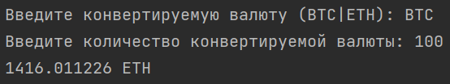
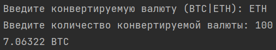

# BTC-ETH-Converter
Сервис, конвертирующий из BTC в ETH и из ETH в BTC.

# Запуск программы
1) Клонировать репозиторий
``` console
git clone https://github.com/BozhkoAV/BTC-ETH-Converter.git
```

2) Собрать Docker образ
``` console
docker build -t btc-eth-converter BTC-ETH-Converter
```

3) Запустить Docker образ
``` console
docker run -it --rm --name converter btc-eth-converter
```

# Инструкция
1) ввести конвертируемую валюту (BTC или ETH)
2) ввести количество конвертируемой валюты

# Примеры


